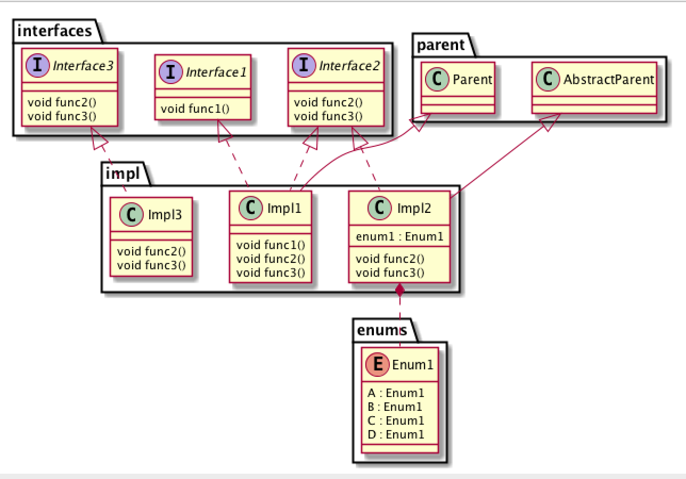
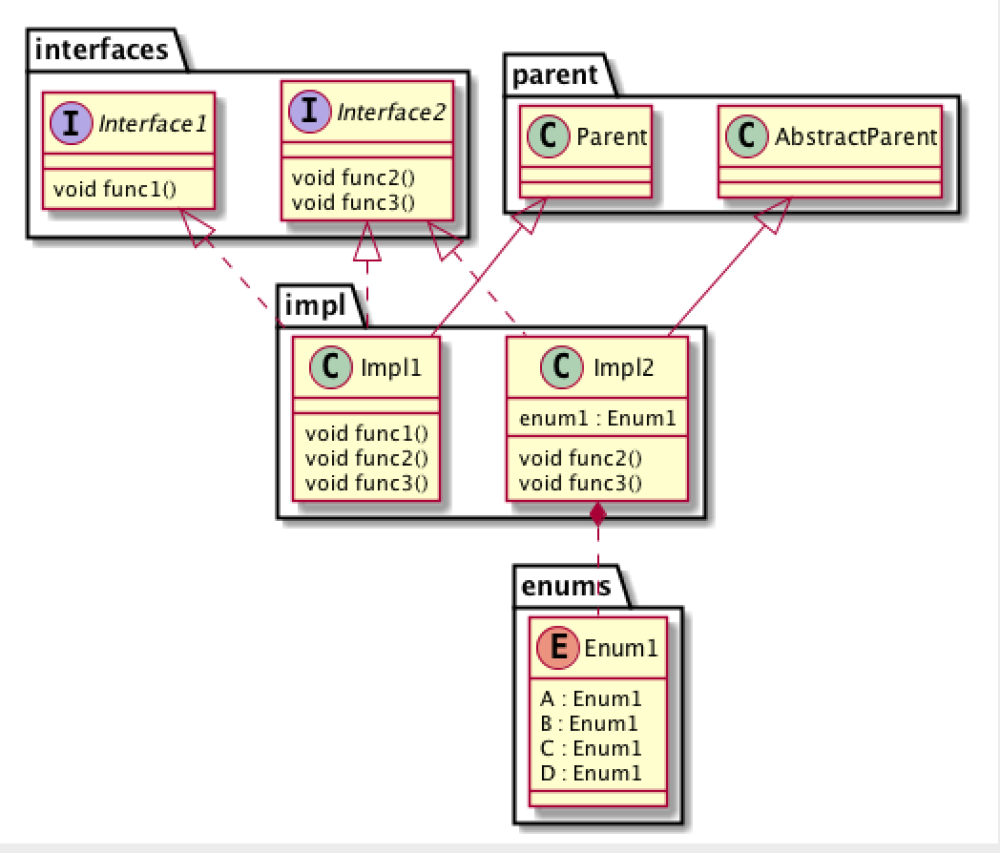
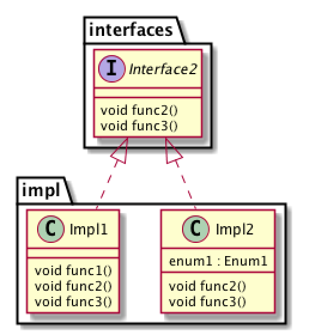
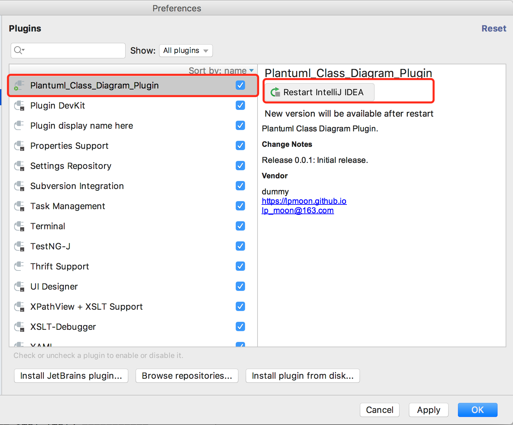
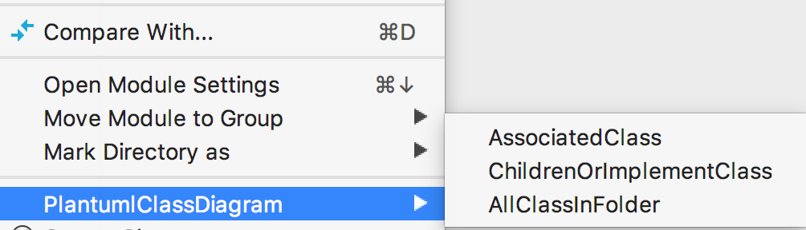

# 1. PlantumlClassDiagram

自动生成plantuml格式的类图

# 2. 如何使用

新建项目Test2，路径为 **~/Project/java/Test2**。在项目内建立如下的文件，

Enum1.java

```
package enums;

public enum Enum1 {
    A,
    B,
    C,
    D
}
```

Impl1.java

```
package impl;

import interfaces.Interface1;
import interfaces.Interface2;
import parent.Parent;

public class Impl1 extends Parent implements Interface1, Interface2 {
    @Override
    public void func1() {

    }

    @Override
    public void func2() {

    }

    @Override
    public void func3() {

    }
}
```

Impl2.java

```
package impl;

import enums.Enum1;
import interfaces.Interface2;
import parent.AbstractParent;

public class Impl2 extends AbstractParent implements Interface2 {

    private Enum1 enum1;
    @Override
    public void func2() {

    }

    @Override
    public void func3() {

    }
}

```

Impl3.java
```
package impl;

import interfaces.Interface3;

public class Impl3 implements Interface3 {

    @Override
    public void func2() {
        
    }

    @Override
    public void func3() {

    }
}
```

Interface1.java

```
package interfaces;

public interface Interface1 {
    public void func1();
}

```

Interface2.java

```
package interfaces;

public interface Interface2 {
    public void func2();
    public void func3();
}

```

Interface3.java

```
package interfaces;

public interface Interface3 {
    public void func2();
    public void func3();
}
```

AbstractParent.java

```
package parent;

public class AbstractParent {
}

```

Parent.java

```
package parent;
public class Parent {
}

```

## 2.1 独立jar

### 2.1.1 编译

```
git clone https://github.com/lpmoon/PlantumlClassDiagram.git
cd PlantumlClassDiagram
sh gradlew build
```

### 2.1.2 使用

进入到 **PlantumlClassDiagram/build/libs**目录下，可以看到com.lpmoon.plantuml.classdiagram.plantuml.class.diagram.jar。


#### 2.1.2.1 某个文件夹下所有类的类图

```
java -jar com.lpmoon.plantuml.classdiagram.plantuml.class.diagram.jar -s ~/Project/java/Test2 -d ~/Project/java/Test2 -n tmp
```

可以在 **~/Project/java/Test2** 目录下看到tmp.puml文件，文件内容是
```
@startuml

' =========== interfaces.Interface2 =========== 
interface interfaces.Interface2{ 
    void func2()
    void func3()
} 


' =========== interfaces.Interface1 =========== 
interface interfaces.Interface1{ 
    void func1()
} 


' =========== impl.Impl2 =========== 
class impl.Impl2{ 
    enum1 : Enum1
    void func2()
    void func3()
} 
parent.AbstractParent<|-- impl.Impl2
interfaces.Interface2<|.. impl.Impl2
impl.Impl2*.. enums.Enum1


' =========== interfaces.Interface3 =========== 
interface interfaces.Interface3{ 
    void func2()
    void func3()
} 


' =========== impl.Impl3 =========== 
class impl.Impl3{ 
    void func2()
    void func3()
} 
interfaces.Interface3<|.. impl.Impl3


' =========== parent.Parent =========== 
class parent.Parent{ 
} 


' =========== impl.Impl1 =========== 
class impl.Impl1{ 
    void func1()
    void func2()
    void func3()
} 
parent.Parent<|-- impl.Impl1
interfaces.Interface1<|.. impl.Impl1
interfaces.Interface2<|.. impl.Impl1


' =========== parent.AbstractParent =========== 
class parent.AbstractParent{ 
} 


' =========== enums.Enum1 =========== 
enum enums.Enum1{ 
    A : Enum1
    B : Enum1
    C : Enum1
    D : Enum1
} 

@enduml

```

使用plantuml渲染后得到的类图为

#### 2.1.2.2 某个类相关的所有类 
```
java -jar com.lpmoon.plantuml.classdiagram.plantuml.class.diagram.jar -s ~/Project/java/Test2 -d ~/Project/java/Test2 -c impl.Impl1 -n tmp
```

可以在 **~/Project/java/Test2** 目录下看到tmp.puml文件，文件内容是

```
@startuml

' =========== interfaces.Interface2 =========== 
interface interfaces.Interface2{ 
    void func2()
    void func3()
} 


' =========== interfaces.Interface1 =========== 
interface interfaces.Interface1{ 
    void func1()
} 


' =========== impl.Impl2 =========== 
class impl.Impl2{ 
    enum1 : Enum1
    void func2()
    void func3()
} 
parent.AbstractParent<|-- impl.Impl2
interfaces.Interface2<|.. impl.Impl2
impl.Impl2*.. enums.Enum1


' =========== parent.Parent =========== 
class parent.Parent{ 
} 


' =========== impl.Impl1 =========== 
class impl.Impl1{ 
    void func1()
    void func2()
    void func3()
} 
parent.Parent<|-- impl.Impl1
interfaces.Interface1<|.. impl.Impl1
interfaces.Interface2<|.. impl.Impl1


' =========== parent.AbstractParent =========== 
class parent.AbstractParent{ 
} 


' =========== enums.Enum1 =========== 
enum enums.Enum1{ 
    A : Enum1
    B : Enum1
    C : Enum1
    D : Enum1
} 

@enduml

```
使用plantuml渲染后得到的类图为

可以看到和之前的图对比，少了Impl3和Interface3，这是因为这两个类和Impl1没有直接的关系。

#### 2.1.2.3 某个类的子类

```
java -jar com.lpmoon.plantuml.classdiagram.plantuml.class.diagram.jar -s ~/Project/java/Test2 -d ~/Project/java/Test2 -c interfaces.Interface2 -n tmp -sub
```
可以在 **~/Project/java/Test2** 目录下看到tmp.puml文件，文件内容是
```
@startuml

' =========== interfaces.Interface2 =========== 
interface interfaces.Interface2{ 
    void func2()
    void func3()
} 


' =========== impl.Impl2 =========== 
class impl.Impl2{ 
    enum1 : Enum1
    void func2()
    void func3()
} 
interfaces.Interface2<|.. impl.Impl2


' =========== impl.Impl1 =========== 
class impl.Impl1{ 
    void func1()
    void func2()
    void func3()
} 
interfaces.Interface2<|.. impl.Impl1

@enduml

```
使用plantuml渲染后得到的类图为

Impl1和Impl2都是Interface2的直属子类。

#### 2.1.2.4 帮助

```
java -jar com.lpmoon.plantuml.classdiagram.plantuml.class.diagram.jar -h
```
可以看到如下的输出

```
-h help  # Print this usage information
-s src   # Source folder
-d dest  # Destination folder
-n name  # Name of generated com.lpmoon.plantuml.classdiagram.plantuml com.lpmoon.com.lpmoon.plantuml.classdiagram.plantuml.classdiagram.file
-c class # Destination class
-sub     # Sub

```
## 2.1 使用Intellij插件


选择从硬盘安装，找到刚才打包好的jar文件，



重启后，打开项目Test2，右键项目文件夹，弹出如下菜单，



选择对应的功能即可

# 3. 下一步开发计划

1. 适配编译好的class文件和jar包
2. 支持eclipse插件
3. 更加完善的类图功能
4. more。。 
